# EvoMass User Guide 使用指引

This user guide is based on EvoMass **0.3.3** and published on **Novermber 21, 2022**.

本指引手册基于EvoMass 0.3.3版本，发布于2022年11月21日

# Contents

[EvoMass User Guide 使用指引](#evomass-user-guide-使用指引)

[1. General Overview 总括](#1-general-overview-总括)

[1.1. Installation 安装](#11-installation-安装)

[1.2. Start your first run of using EvoMass 开始使用](#12-start-your-first-run-of-using-evomass-开始使用)

[1.3. Activation 激活](#13-activation-激活)

[1.4. Learn how to use EvoMass 学习使用EvoMass](#14-learn-how-to-use-evomass-学习使用evomass)

[1.5. About this user guide 关于该指引](#15-about-this-user-guide-关于该指引)

[2. Design Generation Part 1 (Subtractive component) 设计生成1 (减法组件)](#2-design-generation-part-1-subtractive-component-设计生成1减法组件)

[2.1. Basic setting 基本设定](#21-basic-setting-基本设定)

[2.1.1. Initial Volume 初始体量](#211-initial-volume-初始体量)

[2.1.2. Subtractor (Voids) 削减体（负空间](#212-subtractor-voids-削减体负空间)

[2.1.3. Boundary Constraint 边界约束](#213-boundary-constraint-边界约束)

[2.1.4. Generate Cores 生成核心筒](#214-generate-cores-生成核心筒)

[2.1.5. Target Gross Area 目标建筑面积](#215-target-gross-area-目标建筑面积)

[2.1.6. Façade Types 立面类型](#216-façade-types-立面类型)

[2.2. Advanced setting 高级设定](#22-advanced-setting-高级设定)

[2.2.1. Interfering point 干扰点](#221-interfering-point-干扰点)

[2.2.2. Separation Control 分离控制](#222-separation-control-分离控制)

[2.2.3. Custom Boundary 自定义边界](#223-custom-boundary-自定义边界)

[2.2.4. External Volume 外部体量](#224-external-volume-外部体量)

[2.2.5. Remove Small Mass 去除细碎体量](#225-remove-small-mass-去除细碎体量)

[2.2.6. Fixed Void 固定负空间](#226-fixed-void-固定负空间)

[2.2.7. Subtractor Appearing Position 削减体位置控制](#227-subtractor-appearing-position-削减体位置控制)

[2.3. Transformation Setting 变换设定](#23-transformation-setting-变换设定)

[2.3.1. Orientation 朝向](#231-orientation-朝向)

[2.3.2. Shear 切变](#232-shear-切变)

[2.4. Generation setting 生成设定](#24-generation-setting-生成设定)

[2.4.1. Scaling 缩放](#241-scaling-缩放)

[2.4.2. Display Boundary 显示边界](#242-display-boundary-显示边界)

[2.4.3. Shuffle Range 随机变化范围](#243-shuffle-range-随机变化范围)

[2.4.4. Save/Load 保存/载入](#244-saveload-保存载入)

[3. Design Generation Part 2 (Additive component) 设计生成2 (加法组件)](#3-design-generation-part-2-additive-component-设计生成2-加法组件)

[3.1. Basic setting 基本设定](#31-basic-setting-基本设定-1)

[3.1.1. Spatial Boundary 空间边界](#311-spatial-boundary-空间边界)

[3.1.2. Additive Unit Mass 叠加子体量](#312-additive-unit-mass-叠加子体量)

[3.1.3. Generate Cores 生成核心筒](#313-generate-cores-生成核心筒-1)

[3.1.4. Target Gross Area 目标建筑面积](#314-target-gross-area-目标建筑面积-1)

[3.1.5. Façade Types 立面类型](#315-façade-types-立面类型-1)

[3.2. Advance setting 高级设定](#32-advance-setting-高级设定)

[3.2.1. Interfering point 干扰点](#321-interfering-point-干扰点-1)

[3.2.2. Separation Control 分离控制](#322-separation-control-分离控制-1)

[3.2.3. Custom Boundary 自定义边界](#323-custom-boundary-自定义边界-1)

[3.2.4. External Volume 外部体量](#324-external-volume-外部体量-1)

[3.2.5. Vertical Constraint Check 垂直约束检查](#325-vertical-constraint-check-垂直约束检查)

[3.2.6. Fixed Void 固定负空间](#326-fixed-void-固定负空间-1)

[3.2.7. Unit Masses Appearing Position 子体量位置约束](#327-unit-masses-appearing-position-子体量位置约束)

[3.3. Transformation 变换设定](#33-transformation-变换设定)

[3.4. Generation setting 生成设定](#34-generation-setting-生成设定-1)

[4. Design Optimization 设计优化](#4-design-optimization-设计优化)

[4.1. Input/Output 输入/输出](#41-inputoutput-输入输出)

[4.1.1. Connection 连接](#411-connection-连接)

[4.1.2. Outputs 输出](#412-outputs-输出)

[4.1.3. Inputs 输入](#413-inputs-输入)

[4.2. SSIEA setting SSIEA算法设置](#42-ssiea-setting-ssiea算法设置)

[4.3. Optimization Viewer 优化窗口](#43-optimization-viewer-优化窗口)

[4.3.1. Main Viewer 主窗口](#431-main-viewer-主窗口)

[4.3.2. Improvement Viewer 改进解窗口](#432-improvement-viewer-改进解窗口)

[4.3.3. Information Viewer 信息窗口](#433-information-viewer-信息窗口)

[4.4. Data Backup 数据备份](#44-data-backup-数据备份)

[4.5. Restart/Load Optimization 重新开始/载入优化](#45restartload-optimization-重新开始载入优化)

# 1. General Overview 总括

EvoMass is an integrated building massing design generation and optimization tool, primarily aimed at performance-based architectural design. Instead of focusing purely on numerical optimization, the application of EvoMass is aimed to support optimization-based design exploration, where the optimization helps designers to extract design information, understand the design implications related to building performance, and synthesize the information into the ideation and conceptual development process.

EvoMass是一个一体化的建筑体量设计生成及优化工具。该工具主要帮助设计师进行进行性能的建筑设计。与其他设计优化工具有所不同，EvoMass的应用旨在帮助设计师进行基于优化的设计探索，即通过优化帮助设计师提取与性能相关的设计信息和理解设计问题，并最终能够将这些设计信息融入到设计构思和推敲过程之中。

In EvoMass, there are two major parts, including design generation and optimization. For design generation, there are two components that encode the additive and subtractive form generation principles, which can create building massing designs with significant design differentiation and diversity. For design optimization, there is a component implementing a hybrid evolutionary algorithm called SSIEA (steady-state island evolutionary algorithm). SSIEA is aimed to diversify the design population to increase the diversity in the optimization result by using an island-based approach while speeding up the optimization process by using the steady-state replacement strategy.

EvoMass中的组件包含设计生成和优化两部分。在设计生成部分，其包含两个基于“减法”和“加法”的建筑体量形态生成器，这两个生成器能够生成具有显著差异性和多样性的体量形态。在优化部分，其包含一个基于多岛模型和稳态替换策略的进化式算法（SSIEA算法）。该算法具有较高的搜索效率，同时输出的优化结果也较标准遗传算法有更高的多样性。

The combination of the design generation and optimization component as well as other simulation tools such as Ladybugs and ClimateStudio, allows designers to swiftly define the building form and optimization objective and then conduct the optimization. The optimization result serves as a medium of reflection that aims to help designers identify design patterns and implications related to building performance.

上述两部分算法，和其他建筑性能模拟工具，如Ladybugs和ClimateStudio，的结合可以使设计师快速的对设计生成和优化进行定义，并进行对应的设计优化。设计优化的结果可以帮助设计师发现设计中潜在特征和趋势，并以此作为一种对设计问题进行考察和反思的媒介。

## 1.1 Installation 安装

To install EvoMass, simply drag the gha file to the Grasshopper canvas, or replace the old one in the component folder if you already installed it. Remember to **unblock** the gha if you cannot find EvoMass on the Grasshopper tab as shown below.

安装EvoMass，仅需将相应的gha文件拖入Grasshopper界面，或替换在组件文件夹中原有的gha文件即可。如果在完成上述操作后，在工具栏中未出现EvoMass相关标签，请检查gha文件是否已经检索（右击gha文件-属性第一栏最下部）。

If a **loading error** shows up during you start Rhino, you will need to type in “GrasshopperDeveloperSettings” in the Rhino command line and disable the first option as shown below.

如果安装EvoMass后，出现了下图左中的加载错误，可以在Rhino中键入“GrasshopperDeveloperSettings”，并取消第一个选项（下图右）。

|  |   |
|-----------------------|-----------------------|

## 1.2 Start your first run of using EvoMass 开始使用

Running EvoMass is easy, there are several examples provided along with the installation zip file. Simply open one of these examples as shown below, and follow the instructions to define the formal feature of the generated building massing design, design context, optimization objectives, and finally, the parameter of SSIEA. **Note that, Ladybugs need to be first installed on your Grasshopper to run these examples.**

为了帮助使用者快速熟悉EvoMass的操作，在下载的压缩包中提供了多个示例文件。使用这些示例文件（下图），只需跟随上面的指引，对生成参数、场地环境和优化参数进行定义后，便可以运行优化过程。注意，运行这些案例需安装Ladybugs。

## 1.3 Activation 激活

When installing EvoMass for the first time, there are 200 credits along with the installation. After that, you will need to apply for the activation code to renew the credits of using EvoMass. The application of the credit renewal code is free at the moment, and there will be 10000 additional runs added up to your computer. To apply for the credit renewal code, please use these links: [Google Form](https://docs.google.com/forms/d/e/1FAIpQLSf4fYlOATW2Tp3zp6Y9nZynsCx-ZF_2wWzX7xCrRFTzW4x2Jw/viewform) and [腾讯表格](https://docs.qq.com/form/edit/DVGp4VHVGeFpRelN3#/fill), and you will receive an email with the renewal code soon. The below image shows you how to renew the credits of EvoMass on your computer.

第一次安装EvoMass后，将有200次操作次数。随后则需要申请激活码获得更多的操作次数。目前每次激活码申请将获得10000次的操作次数。请使用以下链接申请激活码: [Google Form](https://docs.google.com/forms/d/e/1FAIpQLSf4fYlOATW2Tp3zp6Y9nZynsCx-ZF_2wWzX7xCrRFTzW4x2Jw/viewform) 和 [腾讯表格](https://docs.qq.com/form/edit/DVGp4VHVGeFpRelN3#/fill), 激活码会尽快发至申请中的邮箱。下图为输入激活码的流程。

## 1.4 Learn how to use EvoMass 学习使用EvoMass

Apart from the provided examples, there are several tutorials uploaded to [YouTube](https://youtu.be/DG_VkFP1jB8) and [Bilibili](https://www.bilibili.com/video/BV1w3411C79K?share_source=copy_web). In addition, a couple of research papers also published revolve around the application of EvoMass. You can find the link to these papers on the EvoMass page in Food4Rhino (<https://www.food4rhino.com/en/app/evomass>) as shown below. **It is strongly recommended to read some of these papers, as EvoMass is not a tool simply to produce building forms.**

除了随带的案例，在[YouTube](https://youtu.be/DG_VkFP1jB8) 和 [Bilibili](https://www.bilibili.com/video/BV1w3411C79K?share_source=copy_web) 也提供了影响的教程视频。此外，一些与EvoMass应用相关的研究文章也可以在Food4Rhino找到相关的链接。这些文章也可以帮助使用者更好地理解EvoMass在建筑设计中的应用潜力。

## 1.5 About this user guide 关于该指引

This user guide will take you walk through the major functions of EvoMass. Following this section, the two generative components are first elaborated, followed by the description of the evolutionary algorithm component (SSIEA).

本指引将引导使用者了解EvoMass的主要功能，在本节后，将会对两个生成算法进行介绍，之后再对优化算法进行介绍。

# 2 Design Generation Part 1 (Subtractive component) 设计生成1（减法组件）

The subtractive component implements the subtractive form generation principle. This component generates building massing by creating several voids in a pre-defined spatial volume. By defining the size and position of the void, you can tailor the general formal feature of the generated building massing volume and make it satisfy your design intent. This section presents the major functions of this component.

减法组件以“减法”原则为核心，通过在一个预定义的体积中去除若干空间实现体量的生成。该组件可以通过对负空间的尺寸和位置进行控制，对生成体量的总体特征进行约束和干预，并以此满足不同的设计条件和意图。

## 2.1 Basic setting 基本设定

The basic setting panel of the subtractive component is shown below. In this panel, you can define the most important parameters that affect the formal features of the generated design, including the initial volume, number of voids, size constraint of voids, etc. Kindly remember to click the “**Set Parameter”** button once you have finished defining the parameters

减法组件的基本设定面包如下图所示。该面板包含了控制生成体量形态整体特征的主要参数，包括初始体量、负空间数量和尺寸等。在输入完成后，需按下“Set Parameter”以完成对设计生成的设定。

### 2.1.1 Initial Volume 初始体量

The initial volume lets you define the **type** of the generated building massing, such as high-rise towers or middle-rise complex buildings. In this component, the initial volume is horizontally defined by the column-grid numbers and the span size of the column gird and vertically defined by the number of floors and the floor height. In addition, you can define different span sizes in the two directions and the range of the floor numbers for achieving higher design flexibility.

初始体量帮助设计师对生成建筑的类型进行控制，如高层塔楼或多层综合体等。在该塑件中，初始体量有进深、开间和层数，以及柱间距和层高共同控制。同时柱间距提供了两个方向的尺寸调整，以实现更高的形态灵活性。

|   |   |  |
|------------------------|------------------------|------------------------|
| 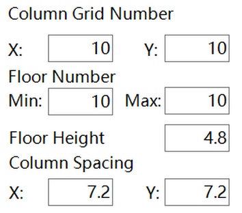 |  |  |
|  |  |  |
|  | 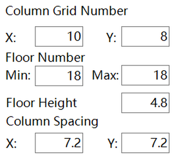 |  |

### 2.1.2 Subtractor (Voids) 削减体（负空间）

Subtractors are used to create the void in the initial volume. The **number** and **size** of the subtractor affect the **complexity** of the generated design. In the subtractive component, there are two types of subtractors: horizontal ones and vertical ones. Regarding horizontal subtractors, they are aimed to create features such as stilts, void decks, and sky gardens. Regarding vertical subtractors, they are aimed to create features such as courtyards and atriums. Therefore, you can set the number to 0 if you don’t want either of the two features appearing in the generated design. In addition, the **size** of the subtractor allows you to define how large the void will be in the generated design.

削减体用于在初始体量中生成负空间。不同的削减体数量和尺寸能够对生成设计的复杂度产生直接影响。减法组件包含水平和垂直两种削减体。前者用于生如架空空间、屋顶平台等水平向空间元素，后者主要生成如中庭、庭院等垂直向空间元素。所以，可以将任一一种的数量设置为0，如果设计师不希望在生成的体量中出现该类空间元素。此外，削减体的尺寸可以帮助设计师对负空间的大小进行干预。

| 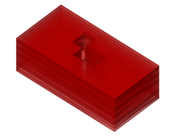 |  |  |
|------------------------|------------------------|------------------------|
| 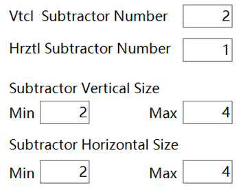 |  |  |
|  |  |  |
| 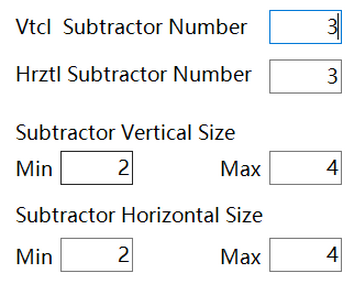 | 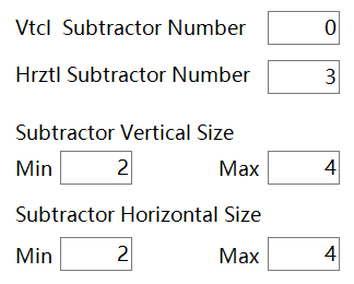 | 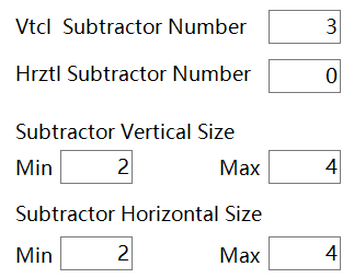 |
|  |  |  |
|  | 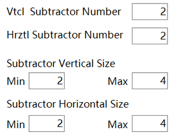 | 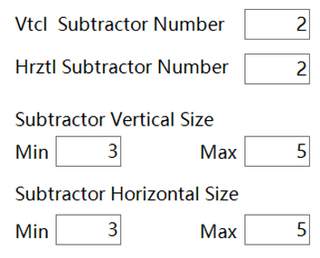 |

### 2.1.3 Boundary Constraint 边界约束

In the subtractive component, the boundary constraint controls the horizontal position of all **vertical voids**. The purpose of the constraint is to allow users to decide how the vertical voids affect the overall building forms, especially whether or not the initial volume visually remains intact. There are different modes. For the first one, all voids are kept inside the volume, thus the boundary of the initial volume will be preserved. For the second one, all voids are kept on the edge of the boundary, which allows the building to have an L-shaped or U-shaped footprint or a staggering boundary. For the third one, there is no constraint on the voids, and the building can be cut into two or three parts.

在减法组件中，边界约束用于控制所有垂直削减体的水平位置。该约束可以帮助设计师更好地控制生成体量的可变范围，尤其是初始体量是否能被保存。目前提供了三种约束方式，第一种方式使所有的垂直削减体在初始体量中间，即初始体量的边界不会被破坏；第二种使垂直削减体在初始体量边界上，可以生成如L型或U型平面的建筑；第三种不对垂直削减体进行约束，可以生成更为自由的形体，如两个分开的体量。

| 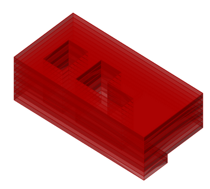 |  |  |
|------------------------|------------------------|------------------------|
|  |  |  |

### 2.1.4 Generate Cores 生成核心筒

This function is aimed to make the generated design more realistic by inserting cores for structural or circulation purposes. The core will affect the voids close to it. In addition, the core control distance defines the distance between the core boundary to the building's external façade surface or the corner.

该功能用于生成核心筒（交通或结构用途）以使生成的设计具有更高的实际参考价值。当使用该功能时，与核心筒相连的削减体会被影响。同时核心筒将会根据与建筑平面尺寸和外墙的距离自动进行数量和位置计算。

|  |  |  |
|------------------------|------------------------|------------------------|
| 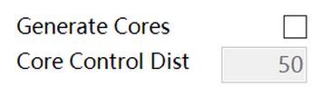 |  | 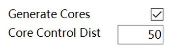 |

### 2.1.5 Target Gross Area 目标建筑面积

This function allows you to define the rough volume of the building by using the **gross floor area**. When it is activated, it will cost more time to generate the building. In addition, please be aware that the component cannot guarantee the target GFA can be achieved under all circumstances, especially when there is a huge gap between the basic volume and the target GFA.

该功能使设计师可以通过建筑面积对生成体量的体积进行大致的控制。开启该功能会消耗更多的计算时间已完成设计生成。同时需要注意的时，该功能无法保证在所有情况下均输出接近目标建筑面积的设计，尤其是当生成建筑与目标建筑面积间面积差值较大时。

|  | 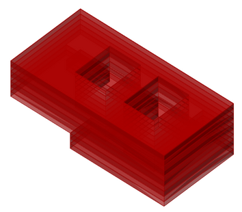 |  |
|------------------------|------------------------|------------------------|
|  |  | 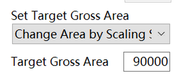 |

### 2.1.6 Façade Types 立面类型

When using different simulation tools, the required window geometry can be different. In the subtractive component, there are four types of façade types, including simple strip openings, simple fully glazed walls, window openings, and fully glazed walls. Please choose the appropriate type according to your project.

不同的性能模拟工具往往需要不同的输入立面类型，因此减法组件提供了四种不同的立面类型，包括连续条形窗、连续落地窗、点窗和玻璃幕墙。请根据性能模拟工具的要求进行选择。

| 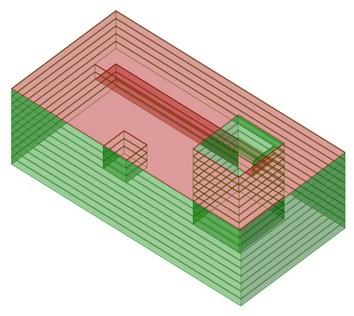 |  |  |
|------------------------|------------------------|------------------------|
|  | 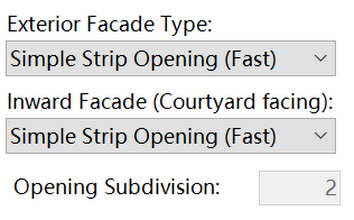 |  |
|  |  |  |
| 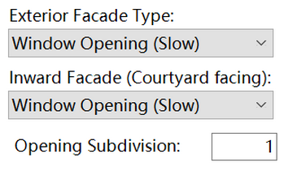 | 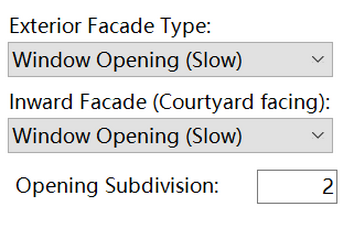 |  |

## 2.2 Advanced setting 高级设定

In the advanced setting, these parameters allow you to create a more complex building massing design or further navigate the generation process to tailor the formal features. These parameters are not mandatory and can be set as default in most cases.

高级设定包含了对生成更复杂体量形体的参数，以及可以更具体控制生成形体的参数。但这些参数在一般情况下并不需要进行设置。

### 2.2.1 Interfering point 干扰点

This function allows you to define a point to attract or repel the void to or from it. For example, you can use it to define an entrance area by attracting more voids to this area. When using this function, you need to first draw a point in **Rhino** instead of in Grasshopper and pick it after you click the “Set Point” button. In addition, positive values mean attraction, and negative values mean repulsion.

该功能需要设计师通过干扰点对削减体的位置进行干预。例如可以将削减体吸引至建筑的一侧或一角以生成入口空间。使用该功能需要在Rhino中生成干扰点，并单击“Set Point”键进行拾取。此外，正数值为吸引，负数值为排斥。

|  |  |  |
|------------------------|------------------------|------------------------|
|  | 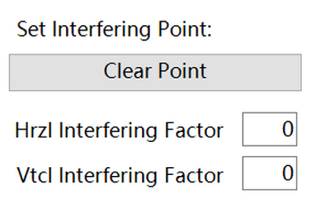 |  |

### 2.2.2 Separation Control 分离控制

This function allows you to define the closeness of the voids. If it is activated, the voids will be more separate from each other in the horizontal and/or vertical directions.

该功能用于控制削减体间的紧密度。如果开启，削减体在垂直和/或水平方向上会相对分离。

|  |  |
|------------------------|------------------------|
|  |  |
|  | 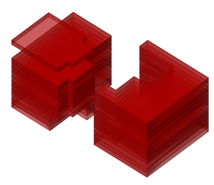 |
| 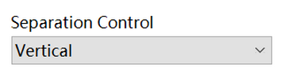 |  |

### 2.2.3 Custom Boundary 自定义边界

This function allows you to define a more complex building footprint by delineating a closed **polyline** in **Rhino** rather than a curve in Grasshopper. The component will try to maintain the boundary constraint when you use this function.

该功能允许设计师生成具有更为复杂平面形状的建筑体量。目前该功能仅允许输入闭合的多段线。该多段线需要在Rhino中进行绘制，并拾取。此外，该功能会尽量满足在基础设置中的边界约束。

|  |  |  |
|------------------------|------------------------|------------------------|
|  |  |  |

### 2.2.4 External Volume 外部体量

This function allows you to define an external fixed volume and combine it with the generated design. The aim of this function is to enable a part of the building to be varied. For example, the tower (fixed) and the podium (variable).

该功能允许设计师在设计生成中加入一个固定不变的外部体量。该功能可用于仅需要一部分建筑可变的设计条件下，如塔楼不变，裙房可变。

|  |  |  |
|------------------------|------------------------|------------------------|

### 2.2.5 Remove Small Mass 去除细碎体量

This function allows you to remove masses that are too small. This function is useful when there is a no-boundary-constraint or a keep-vertical-voids-on-boundary.

该功能将自动去除生成体量中过小的体量。该功能仅在无边界约束或使所有垂直削减体在初始体量边界时有效。

|  |  |
|------------------------|------------------------|
| 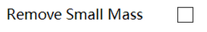 | 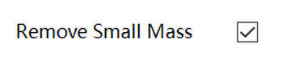 |

### 2.2.6 Fixed Void 固定负空间

This function allows you to define an invariable void in the initial volume, which can be considered as a courtyard or an L-shaped footprint.

该功能用于在生成体量中加入一个不可变的负空间，例如一个中庭建筑或L型平面的建筑。

| 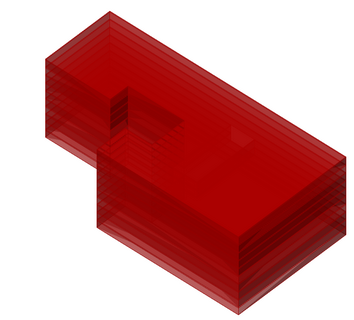 |  |  |
|------------------------|------------------------|------------------------|
| 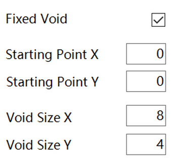 |  | 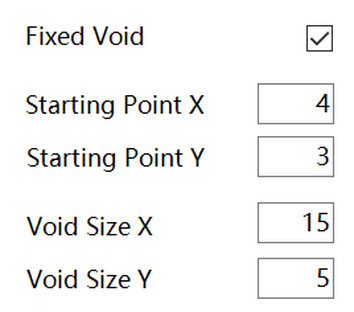 |

### 2.2.7 Subtractor Appearing Position 削减体位置控制

This function allows you to define the vertical position that all horizontal voids can be generated. The aim of this function is to create a more specific type of building such as a building with stilts and cascading roofs.

该功能用于控制水平削减体在垂直方向的位置。该功能可以进一步精确定义生成设计的特征，如仅存在底层架空或屋顶平台等。

|   |  |  |
|-------------------------|-------------------------|-------------------------|
|  |  | 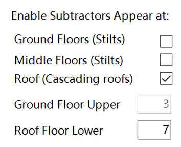 |

## 2.3 Transformation Setting 变换设定

The tab of transformation contains functions that can achieve more complex morphological changes in the generated design.

该部分设置用于实现更复杂的形态变化。

### 2.3.1 Orientation 朝向

This function allows you to change the orientation of the building by rotating the building based on its center point. The “Start” and “End” do not directly mean the starting and ending angle, and the rotation range is also affected by the “Step Size”. In this component, the range of rotation is from the starting value \* step size to the ending value \* step size. Therefore, if the starting value is -20 and the ending value is 15, and the step size is 2, these lead to the rotation range from -40 degrees to 30 degrees. In addition, it is not allowed the rotation range smaller than -90 degrees and larger than 90 degrees.

该功能通过旋转体量以改变建筑的朝向。旋转的起始（Start）和结束（End）并非为角度值，而是同时会收到旋转步长的影响。即旋转范围为“起始\*步长“至”结束\*步长“。例如，当起始值为-20，结束值为15，步长为2时，旋转范围为-40至30度。此外，旋转范围仅允许在-90至90度之间。

|  | 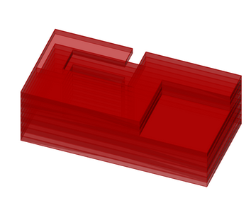 |  |
|-------------------------|-------------------------|-------------------------|
|  |  |  |

This function is more useful when combined with the custom boundary. When you define a custom boundary, the design can create buildings with a fixed footprint but the void can face different directions.

该功能也可与自定义边界结合使用。当存在自定义边界时，可以通过该功能探索不同朝向的削减体对建筑性能的影响。

|  | 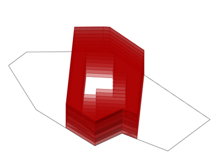 |  |
|-------------------------|-------------------------|-------------------------|
|  |  |  |

### 2.3.2 Shear 切变

This function allows you to easily make shear transformation of the generated building design. Note that the value set here will not be changed during the optimization process.

该功能可以对生成的建筑体量进行切变变换。请注意，所设定的参数，即切变角度，在优化过程不会改变。

|  |  |  |
|-------------------------|-------------------------|-------------------------|
|  |  |  |

## 2.4 Generation setting 生成设定

Generation setting allows you to control the generation of the design, such as scaling up the generated building, displaying the boundary, and controlling the range of design variation when shuffling the design.

生成设定帮助设计师对生成的建筑进行控制，例如缩放，显示边界，控制可变范围。

### 2.4.1 Scaling 缩放

Due to different simulation tools that may use different unit systems, this function allows you to scale up the building geometry.

由于不同的性能模拟软件采用不同的单位，该功能帮助设计师快速对生成的建筑进行缩放。

|  |  |  |
|-------------------------|-------------------------|-------------------------|
|  |  |  |

### 2.4.2 Display Boundary 显示边界

This function allows you to display the maximum volume of the generated design. The aim of this function is to help you detect whether the generated design collides with surrounding buildings. This function also works when the custom boundary is defined

该功能用于检查初始体量和自定义边界是否正确，尤其是是否与周边场地建筑存在冲突（如交叠）。

|  |  |  |
|-------------------------|-------------------------|-------------------------|
|  |  |  |

### 2.4.3 Shuffle Range 随机变化范围

This function allows you to control the variability when shuffling the design. This function is aimed to support more detailed and subtle design exploration based on an optimized design, and see whether there is a feasible design similar to the optimized design you select. When the shuffle range is below 100%, the current parameters for the generated design will be restored, and all the variations of the parameters will be conducted based on these restored parameters. If you want to use the parameters of the shuffled design as the basis point for design variation, you can click the “Update Massing” button, and the current parameters will be restored.

该功能用于控制体量随机变化时的可变范围控制。该功能用于针对所选择设计（一般为优化结果中分值较高的设计）进行进一步的细微变化探索。当该值小于100%时，当前设计的参数将被记录，并以此作为中心点进行参数的调整。如果希望以当前设计为中心点，请单击“Update Massing“。

| 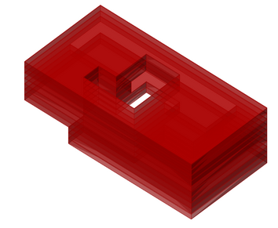 |  | 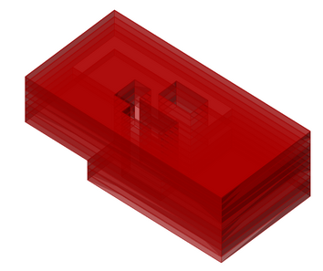 |
|-------------------------|-------------------------|-------------------------|
|  |  |  |
|  |  |  |
| 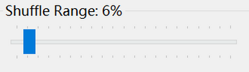 |  |  |

### 2.4.4 Save/Load 保存/载入

This function allows you to save the setting you define as an external file and load it from another \*.gh file or computer. This function makes it easier to restore your setting and re-uses it by others or in other projects.

该功能可以将现有的参数设定（基本设定、高级设定和变换设定）保存为外部文件，并可以被其他gh文件中的相应组件（减法组件）载入。该功能帮助设计师更好地保存不同的生成参数设定，并被其他人或在其他项目总再次使用。

# 3 Design Generation Part 2 (Additive component) 设计生成2 （加法组件）

The additive component implements the additive form generation principle. This component generates building massing by aggregating multiple unit masses in a pre-defined spatial boundary. By defining the size and position of the unit mass, you can tailor the general formal feature of the generated building massing volume and make it satisfy your design intent. This section presents the major functions of this component.

加法组件以“加法”原则为核心，通过在一个预定义的空间边界中叠加若干子体量实现体量的生成。该组件可以通过对子体量的尺寸和位置进行控制，对生成体量的总体特征进行约束和干预，并以此满足不同的设计条件和意图。

## 3.1 Basic setting 基本设定

The basic setting panel of the subtractive component is shown below. In this panel, you can define the most important parameters that affect the formal features of the generated design, including the spatial boundary, number of unit masses, size constraint of unit masses, etc. Kindly remember to click the “**Set Parameter”** button once you have finished defining the parameters

加法组件的基本设定面包如下图所示。该面板包含了控制生成体量形态整体特征的主要参数，包括预定义空间边界、子体量数量和尺寸等。在输入完成后，需按下“Set Parameter”以完成对设计生成的设定。

### 3.1.1 Spatial Boundary 空间边界

The spatial boundary lets you define the **type** of the generated building massing, such as high-rise towers or middle-rise complex buildings. In this component, the initial volume is horizontally defined by the column-grid numbers and the span size of the column gird and vertically defined by the number of floors and the floor height. In addition, you can define different span sizes in the two directions and the range of the floor numbers for achieving higher design variability.

空间边界帮助设计师对生成建筑的类型进行控制，如高层塔楼或多层综合体等。在该塑件中，初始体量有进深、开间和层数，以及柱间距和层高共同控制。同时柱间距提供了两个方向的尺寸调整，以实现更高的形态灵活性。

|  |  |  |
|-------------------------|-------------------------|-------------------------|
|   |   |   |
|  |  |  |
|   |   |   |

Due to the generative mechanism, the generated design based on the additive component cannot ensure that the generated volume can achieve the defined dimension in terms of the footprint and floor number. Therefore, if you want to make the generated design can achieve the column grid and floor number value, you can enable the “Full Height Constraint” and “Fill Boundary”.

由于加法的生成机制，生成设计的常常无法占满整个预定义的空间，例如在较大的范围内生成较小的体量。因此，如果希望生成设计能够占满生成范围，可以使用“Full Height Constraint” 和 “Fill Boundary”来确保生成设计在垂直和水平方向占满生成范围。

| 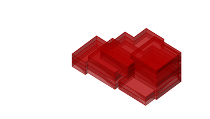 |  |
|-------------------------|-------------------------|
|  | 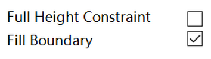 |
| 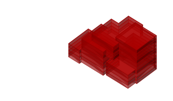 |  |
|  | 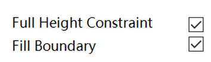 |

### 3.1.2 Additive Unit Mass 叠加子体量

The additive component creates the building volume by aggregating multiple unit masses. The **number** and **size** of the unit mass affect the **complexity** of the generated design. In addition, there are two approaches to controlling the overall volume of the generated design. The first one is using the “Filling Factor”, which can be understood as how much the initial volume will be filled, and each unit mass will be scaled up or down according to the “Filling Factor”. The second one is using “Actual Size Constraint”, which allows you to specify the actual size range of each unit mass. Moreover, you can set the same value for the min and max of the size range, which results in rectangle unit masses.

加法组件通过多个子体量的叠加生成建筑体量。子体量的个数和尺寸会对生成设计的复杂度产生影响。通过该组件有两种控制总体形态特征的方法。第一种采用填充系数，该方法可以理解为预定义空间内建筑所占空间的大致比例，该方法对建筑体量进行总体的缩小或放大。第二种为采用实际尺寸对每个子体量进行控制。此外，可以对子体量尺寸的上下限设置相同的值，以生成正方形平面的子体量。

|  |  |  |
|-------------------------|-------------------------|-------------------------|
|  | 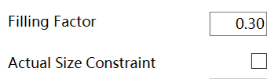 | 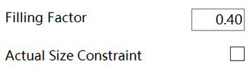 |
|  |  |  |
| 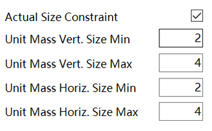 |  | 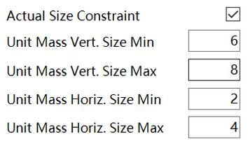 |
|  |  |  |
| 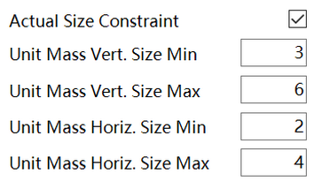 |  | 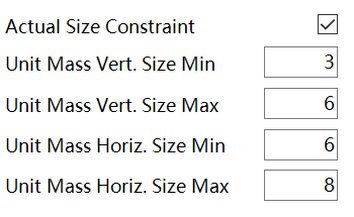 |
|  |  |  |
|  | 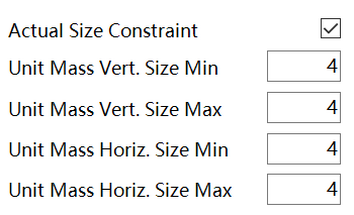 |  |

I

### 3.1.3 Generate Cores 生成核心筒

Same as the “Generate Cores” function in the subtractive component. Please refer to [2.1.4.](#214-generate-cores-生成核心筒)

该部分内容请参考2.1.4

### 3.1.4 Target Gross Area 目标建筑面积

Same as the “Generate Cores” function in the subtractive component. Please refer to [2.1.5.](#215-target-gross-area-目标建筑面积)

该部分内容请参考2.1.5

### 3.1.5 Façade Types 立面类型

Same as the “Generate Cores” function in the subtractive component. Please refer to [2.1.6.](#216-façade-types-立面类型)

该部分内容请参考2.1.6

## 3.2 Advance setting 高级设定

In advance settings, these parameters allow you to create more complex building massing designs or further navigate the generation process to tailor the formal features. These parameters are not mandatory and can be set as default in most cases.

高级设定包含了对生成更复杂体量形体的参数，以及可以更具体控制生成形体的参数。但这些参数在一般情况下并不需要进行设置。

### 3.2.1 Interfering point 干扰点

This function allows you to define a point to attract or repel the unit mass to or from it. For example, you can use it to define an entrance area by repelling more unit masses to this area. When using this function, you need to first draw a point in **Rhino** instead of in Grasshopper and pick it after you click the “Set Point” button. In addition, positive values mean attraction, and negative values mean repulsion.

该功能需要设计师通过干扰点对削减体的位置进行干预。例如可以将削减体吸引至建筑的一侧或一角以生成入口空间。使用该功能需要在Rhino中生成干扰点，并单击“Set Point”键进行拾取。此外，正数值为吸引，负数值为排斥。

|  |  | 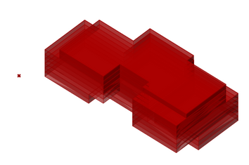 |
|-------------------------|-------------------------|-------------------------|
|   |   |   |

### 3.2.2 Separation Control 分离控制

This function allows you to define the closeness of the unit mass. If it is activated, the unit mass will be more separate from each other in the horizontal and/or vertical directions. Please be aware that this function will only affect when two or more voids are close to one another.

该功能用于控制削减体间的紧密度。如果开启，削减体在垂直和/或水平方向上会相对分离。

|  |  |
|-------------------------|-------------------------|
|   |   |
|  | 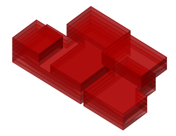 |
|   |   |

### 3.2.3 Custom Boundary 自定义边界

This function allows you to define more complex building footprint by delineating a **polyline** in **Rhino** rather than a curve in Grasshopper. When active, all the unit masses will be attempted to be kept inside the boundary.

该功能允许设计师生成具有更为复杂平面形状的建筑体量。目前该功能仅允许输入闭合的多段线。该多段线需要在Rhino中进行绘制，并拾取。此外，该功能会尽量满足在基础设置中的边界约束。

|  |  |  |
|-------------------------|-------------------------|-------------------------|
| 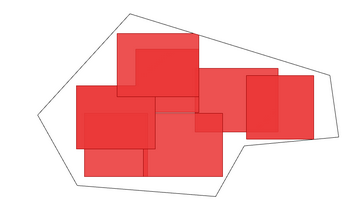 |  | 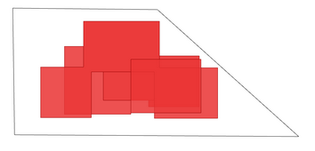 |

### 3.2.4 External Volume 外部体量

Same as the “External Volume” function in the subtractive component. Please refer to [2.2.4.](#224-external-volume-外部体量)

该部分内容请参考2.2.4

### 3.2.5 Vertical Constraint Check 垂直约束检查

When using the additive component, it is easier for generating chaotic designs such as floating volume than in the subtractive component. Therefore, in default, three constraints are implemented to avoid these chaotic designs. However, you can turn them off in case a certain degree of infeasibility can be allowed.

加法法则的生成逻辑常常会导致无效设计的生成，如悬浮在空中的体量。因此，加法组件包含了三个用于约束体量垂直方向的功能，这些功能功能确保生成设计在建筑上的有效性。但是当实用要求较低时，这些约束也可以被关闭。

|  | 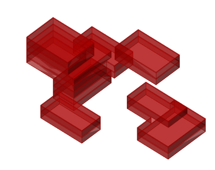 |   |
|-------------------------|-------------------------| -------------------------|
|   |   |   |
|  | 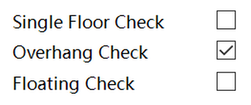 |  |

### 3.2.6 Fixed Void 固定负空间

Same as the “Fixed Void” function in the subtractive component. Please refer to [2.2.6.](#226-fixed-void-固定负空间)

该部分内容请参考2.2.6

### 3.2.7 Unit Masses Appearing Position 子体量位置约束

Same as the “Subtractor Appearing Position” function in the subtractive component. Please refer to [2.2.7.](#227-subtractor-appearing-position-削减体位置控制)

该部分内容请参考2.2.7

## 3.3 Transformation 变换设定

Same as the “Transformation” tab in the subtractive component. Please refer to [2.3.](#23-transformation-setting-变换设定)

该部分内容请参考2.3

## 3.4 Generation setting 生成设定

Same as the “Generation setting” in the subtractive component. Please refer to [2.3.](#23-transformation-setting-变换设定)

该部分内容请参考2.3

# 4 Design Optimization 设计优化

In order to drive the optimization process, EvoMass provides a hybrid evolutionary algorithm called Steady-State Island Evolutionary Algorithm (SSIEA). SSIEA is designed to support a more explorative optimization search by subdividing the design population into several subpopulations, each can focus on a distinct region in the whole design search space. In addition, the component containing SSIEA also implements functions to facilitate the use of EvoMass such as auto-backup and screen capture, etc.

为了驱动设计的自动优化，EvoMass提供一个混合进化算法。该算法借助“多岛模型“和”稳态替换策略“将设计种群分为多个子种群，并使每个子种群搜索设计空间中不同的子区域，以实现更具探索性的设计寻优。此外，在EvoMass中，优化算法组件还包括了如自动备份和截屏等多种功能。

## 4.1 Input/Output 输入/输出

### 4.1.1 Connection 连接

The SSIEA component allows you to connect multiple generative components (subtractive/additive) as the outputs so that you can evolve multiple buildings at the same time for small-scale urban design tasks. However, it is not recommended to connect too many components as it will significantly increase the search difficulty for the optimization. In addition, this component also allows you to connect multiple value sources as the inputs, but you can only assign two of them as optimization objectives and the rest of these inputs will be automatically recorded during the optimization and will not affect the optimization. For the input, you can **rename** the nickname of the value parameter, which can be identified by the SSIEA component. **Lastly, for each input, it should only contain one value, no list or tree data is allowed.**

SSIEA组件允许在输出端同时连接多个生成组件（减法/加法组件），以此同时对多个体量进行优化。但是，连接过多的生成组件会增加优化的难度，因此不建议连接超过多于3个生成组件。另一方面，该组件也允许在输入端连接多个数据来源，但是只能有两个作为优化目前，其他的输入数据则仅会被记录，不会对优化产生影响。对于输入端的数据来源，可以通过更改数据所在组件的别称使SSIEA组件对这些数据来源进行识别（后续会进一步解释）。最后没有输入数据来源中仅能包含一个数值，不可为数据列表或树状数据结构。

### 4.1.2 Outputs 输出

Once the input and output are properly defined, double click the SSIEA component, and the below viewer will be shown up. The default tab will be the output, and you can define the output here, such as changing the type of outputs and optimization direction. For the output type, it defines whether the selected output is an optimization objective or not. If the selected output is changed to fitness, you will also need to define the direction of the optimization search, i.e. maximizing or minimizing the fitness value. Lastly, you can see the nickname of the output in the first column. **Please note that only two inputs can be assigned as fitness.**

当输入和输出端连接完毕，双击SSIEA组件以打开控制对话框。默认的标签栏和对话框为输出设定，该对话框可以对输出端进行设置。这部分主要设置输入参数的类型，包括适应度（Fitness）和数值（Value）。设为适应度的输入参数将对优化产生影响，同时需要在Direction（优化方向）一栏选择对该适应度的优化是最大化（Maximize）或是最小化（Minimize）。最后，你可以在第一栏看到输入数值组件的昵称。需要注意的是，仅有两个输入数值可以被设置为适应度。

### 4.1.3 Inputs 输入

In this tab, you can change the viewer to show the information of the input. In the input viewer, you can see the parameter number of the component. If there are multiple generative components connected, you can also see the names of the connected components. **In most cases, you don’t need to check this tab as no parameter needs to change here.**

该对话框可以查看所连接生成器所需要的参数数量，如果有多个连接的生成器，也可以看到这些生成器的名称。在绝大多数情况下，不需查看该对话框。

## 4.2 SSIEA setting SSIEA算法设置

The second tab of the component viewer is the setting for SSIEA. In this tab, you can define the parameter related to SSIEA to adjust the search behavior of the optimization search.

第二个标签栏是与SSIEA算法相关的设置参数，这些参数将对优化算法的搜索行为产生影响。

As SSIEA uses an island-based approach that subdivides the design population into subpopulations, the setting of SSIEA for the design population is a little different from other evolutionary algorithms. In SSIEA, you need to define the **number of subpopulations** and **the size of the subpopulation**. The former means how many subpopulations will be created, and the latter means how many design individuals in each subpopulation. Therefore, the total population number is *the number of subpopulations* times *the size of the subpopulation*. In addition, as there are multiple subpopulations, SSIEA allows the design to be migrated from one subpopulation to another one if the latter subpopulation reaches convergence. Thus, you can use the **migration rate** to adjust the possibility of migration. Be aware that, higher migration rates may reduce the design diversity in the optimization result, as high-fitness designs migrated from other subpopulations can eliminate the high-fitness ones in the current subpopulation. The functions of other parameters are listed below.

由于采用了“多岛模型“，SSIEA算法的参数设置与常见遗传算法的设置略有不同。在使用SSIEA时，需要对子种群的个数和大小进行设计，前者控制子种群的个数，后者控制每个子种群中个体的数量。所以，设计种群的总数为子种群个数\*子种群大小。同时，由于存在多个子种群，SSIEA允许个体在子种群间进行迁移，尤其是时当个别子种群已进行收敛后。因此，可以通过迁移率来调整个体迁移的概率。需要注意的是，迁移率过高会降低优化结果中设计的多样性，这是由于较优的个体迁移至另一子种群后，往往会迅速淘汰原有的个体。下表概况了主要的参数含义。

| **Parameter 参数** | **Meaning 含义** |  **Typical Value 典型值** |
|-------------------------|-------------------------| -------------------------|
|   |   |   |
|  |  |  |

Once all the parameters are defined, you can click the “**Start**” button to lunch the optimization. **Please be aware that, after the optimization is started, EvoMass will automatically create a bunch of backup files, including the gh file, optimization data, generative component setup, etc, in a backup folder where you save this current gh file. In addition, the previous backup files will be overwritten. Thus, it is recommended to create a new folder to restore the gh file for each optimization run.**

当所有参数设定完毕，请按下“Start“按钮开始优化。请注意，当优化开始后EvoMass会自动在当前的文件夹创建一个备份文件夹，其中包括优化过程数据、备份的gh文件和生成组件的设置文件。同时，如果该目录下已有的备份文件将会被覆盖。所以，在进行每次优化前，建议将gh文件放入一个空文件夹。

## 4.3 Optimization Viewer 优化窗口

### 4.3.1 Main Viewer 主窗口

Once an optimization starts, another optimization progress viewer will pop up. In this viewer, you can monitor the progress of the optimization, current generations, and the number of iterations left for the optimization. The main table lists all the generated and evaluated design, their fitness scores, other recorded values, and parameters. When the mouse hovers on any of these items, a preview image will pop up if you enable the “Save ScreenShots” option in the SSIEA setting panel. Regarding the “**Display Option**”, you can select the designs from a specific subpopulation. Regarding the “**Filter**”, you can select only displaying improvement designs or the Pareto solutions. If you ticked the “**only show current population**”, only the alive designs will be listed in the table.

当优化开始后，将会出现一个显示优化进程的窗口（下图）。该窗口可以用于监视优化进行，当前代数，迭代次数等。该窗口同时列出了所有已生成和分析的设计。当鼠标悬停在任一行时，该设计的缩略图将会显示（需在优化前开启自动截图功能）。在“**Display Option**”中，可以选择选择任一子种群，并使列表仅显示该子种群中的设计。在“**Filter**”中，可以选择改进解和帕累托解，以使列表仅显示这些设计。若选择“**only show current population**”，则列表仅会显示设计种群中所保留的解，即优化过程中淘汰的设计将不会被显示。

### 4.3.2 Improvement Viewer 改进解窗口

If you click the “**Improvement**” button, a diagram of the improvement designs will pop up. The color of the line indicates the subpopulation of the design. In addition, in the “**Display Option**”, you can choose different details to be shown in the diagram.

单击“**Improvement**”后，改进解窗口将会弹出。该图中线段的颜色代表不同子种群中改进解出现的位置。此外，在“**Display Option**”中，可以选择不同的显示内容。

### 4.3.3 Information Viewer 信息窗口

In the main viewer, once you click the “**Information**” button, a diagram of the optimization progress will pop up. The color of the line indicates the subpopulation. The thinner line indicates the average fitness progress of each subpopulation, and the thicker line indicates the standard deviation of the fitness in each subpopulation. By clicking the “**Display Option**”, you can change the displayed information to the Parallel Coordinate.

在主窗口，当单击“**Information**”键后，显示优化进程的窗口将会弹出。线段的颜色表示各个子种群。细线表示每个子种群平均适应度变化，粗线则表示每个子种群个体适应度标准差的变化，该指标用于分析子种群中个体的差异度。当单击“**Display Option**”后，将显示平行坐标系。

In the Parallel Coordinate diagram, you can see the distribution of the parameter of each design.

在平行坐标系中，可以查看设计生成参数和适应度的分布情况。

In the “**Display Option**”, you can also choose the one only displaying the fitness and values while hiding the parameter values. In addition, you can **right-click** and select the “**Color Sorted by Fitness**” to sort the displaying color. (The default color is sorted by the subpopulation.)

在“**Display Option**”中，可以选择仅显示适应度和数据记录，即不再显示设计生成参数。此外，可以在窗口右击鼠标，选择“**Color Sorted by Fitness**”，使线段的颜色按适应度进行排序。（默认的颜色按子种群进行排序）

## 4.4 Data Backup 数据备份

When the optimization is running, a backup folder is automatically created to restore the data related to the optimization. **Please be aware that, EvoMass will automatically create a bunch of backup files, including the gh file, optimization data, generative component setup, etc, in a backup folder where you save this current gh file. In addition, the previous backup files will be overwritten. Thus, it is recommended to create a new folder to restore the gh file for each optimization run.**

当优化开始后，EvoMass将在当前gh文件所在文件夹创建一个备份文件夹用于储存与优化相关的数据。请注意，EvoMass将会自动创建一系列备份文件，包括gh文件拷贝，优化数据，生成组件设定等。同时，如果该文件夹内已有之前优化的备份文件夹，该备份文件夹中的文件也将会被覆盖。所以建议每次优化时，将gh拷贝至一个新的文件夹后再进行优化。

In this folder, you will find a bunch of XML files with the name backupXXX.xml. These XML files are created at the end of each generation, and the last one is created at the latest generation. **In addition, if the optimization is accidentally stopped or interrupted, you can use the latest one to restart the optimization.**

在备份文件夹中，包含一些列以Backupxxx.xml命名的文件，这些文件是在优化过程中每代结束后自动创建的，而最后一个则创建于优化结束时。所以，若优化过程意外中断，可以使用最后一个文件恢复已进行的优化。

In addition, if you accidentally change your original gh file, you can find a backup gh file in this folder. **It is important because the backup XML file can only be successfully loaded if all the settings of the EvoMass components and value/fitness components are unchanged (because the design generation parameters cannot generate the same design if the parameters in the component are changed)**. Lastly, in the images folder, you will find all the screenshots captured during the optimization. However, the images folder will not be created if you didn’t click the “Save ScreenShots” option.

另外，如果不慎修改了原有的gh文件，可以在备份文件夹中找到原有gh文件的拷贝。确保运行优化的gh文件不被更改十分重要，因为若gh文件中生成组件内的参数更改后，优化文件将无法被读取（因为原有的生成参数无法生成优化时生成的设计）。最后，图片文件夹中包含所有在优化过程中截取的设计截图。但是，若没有在优化算法参数中选择“Save ScreenShots”，这些图片将不会被创建。

## 4.5 Restart/Load Optimization 重新开始/载入优化

It is common that the optimization is interrupted by computer crushing, or you need to stop it and restart it again tomorrow. In addition, you may want to restore the data first and analyze the result later on. Therefore, in EvoMass you can load the optimization data whenever it is convenient for you. When stoping the optimization, you don’t need to save the optimization process, but you just need to find the latest XML file in the backup folder. With this file, click the “**Load Project**” button on the SSIEA tab and the optimization will be loaded.

在优化过程中，时长会出现意外打断优化，或者由于特殊原因需要被人为打断。或者优化结束后，希望能够保存优化结果，以备后续进行分析。所以，EvoMass提供了载入优化结果的功能，帮助设计师在方便的时间对优化结果进行分析。如果优化被打断，不需要人为对优化进程进行保存，仅需要在备份文件夹找到最近的XML文件，然后在SSIEA界面单击“**Load Project**”并选取该文件。

If the loaded optimization is not finished, click the “**Restart Solving**” button once the main viewer pops up.

如果载入的优化尚未完成，单击随后弹出的优化主窗口上的“**Restart Solving**”按钮以继续优化过程。

